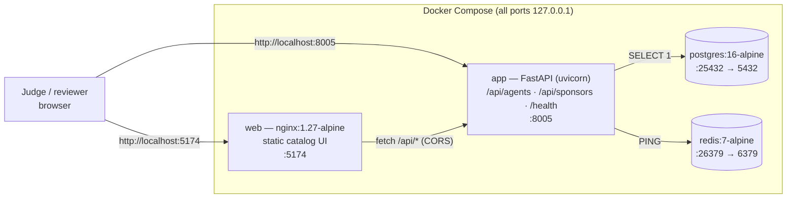

# Architecture — PPAA Agent Showcase

DevNetwork 2026 submission surface (Jira epic PP-63; catalog layer delivered as
PP-79, multi-sponsor adapter layer as PP-80). Deadline: 2026-09-03.

## System overview



## AFD-108 architecture rule

Development and staging run on **Docker PostgreSQL 16** and **Redis 7-alpine**
only. Supabase/managed services are **production-only** and never referenced by
local configuration. Published host ports never retain base `5432`/`6379`
mappings (PP-83 rule) and always bind to loopback. Both rules are enforced by
deterministic tests (`tests/test_compose_ports.py`), not convention.

## Services

| Service   | Image              | Published host target        | Role                                   |
|-----------|--------------------|------------------------------|----------------------------------------|
| `app`     | built (`Dockerfile`, Python 3.12-slim) | `127.0.0.1:8005` | FastAPI catalog API + same-origin static fallback |
| `web`     | `nginx:1.27-alpine`| `127.0.0.1:5174`             | Static catalog UI, no build step       |
| `postgres`| `postgres:16-alpine` | `127.0.0.1:25432` → 5432   | Dependency-verification target (SELECT 1) |
| `redis`   | `redis:7-alpine`   | `127.0.0.1:26379` → 6379     | Dependency-verification target (PING)  |

## Data flow

1. The catalog source of truth is the repo file `data/agents.json`
   (`updated`, `source`, `agents[]`). It is loaded by
   `src/ppaa_showcase/catalog.py` (pydantic-validated, cached per process).
2. The static UI (`frontend/`) fetches `/api/agents` and renders the fleet
   client-side, plus a sponsor strip from `/api/sponsors` (PP-80). Sponsor
   rendering is failure-isolated: a sponsor error can never blank the agent
   grid. No server-side rendering, no build toolchain.
3. `/health` performs a real `SELECT 1` against Postgres and a real `PING`
   against Redis so "healthy" means dependencies are actually reachable.
4. Inside the container the app resolves packaged copies of `frontend/` and
   `data/` under `/srv` when the repo layout is absent (image-only mode).
5. The sponsor registry source of truth is `data/sponsors.json`
   (`updated`, `source`, `sponsors[]`), loaded by
   `src/ppaa_showcase/sponsors.py`. Each sponsor declares an integration
   descriptor (type + config keys) served by an adapter class
   (`CatalogFeedAdapter` / `WebhookAdapter` / `APIKeyAdapter`). The registry is
   cross-validated against the agent catalog at request time: duplicate ids,
   unknown integration types, contract mismatches, and dangling agent slugs
   all fail closed. Adapters describe integration *shapes* only — no sponsor
   credentials are stored in this repo.

## Repository layout

```
src/ppaa_showcase/   FastAPI app (main, config, catalog, sponsors, health)
data/agents.json     catalog source of truth (schema-validated)
data/sponsors.json   multi-sponsor registry (adapter-validated)
frontend/            static catalog UI (HTML/CSS/JS, no build step)
scripts/demo.sh      deterministic scripted demo (docs/DEMO.md)
docs/                SETUP, API, ARCHITECTURE, DEMO, SUBMISSION guides
tests/               API, catalog-data, sponsor-adapter, render-smoke, compose-port, and docs tests
docker-compose.yml   pg16 / redis7 / app / web staging stack
```

## Branching

`feature/*` branches → `staging`. `main` is protected; production merges
require Ade's approval. Never deploy or claim from an SHA other than the exact
candidate under review.
